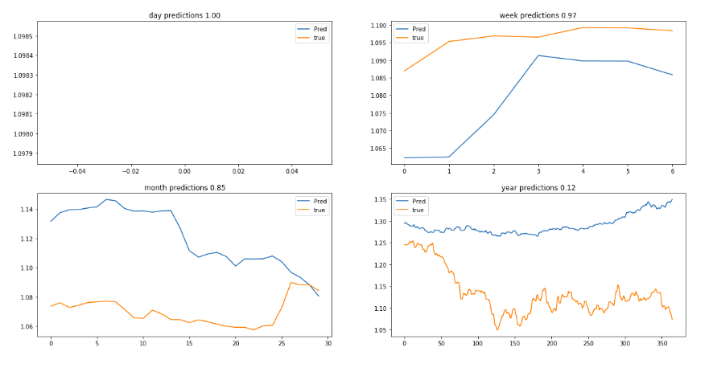
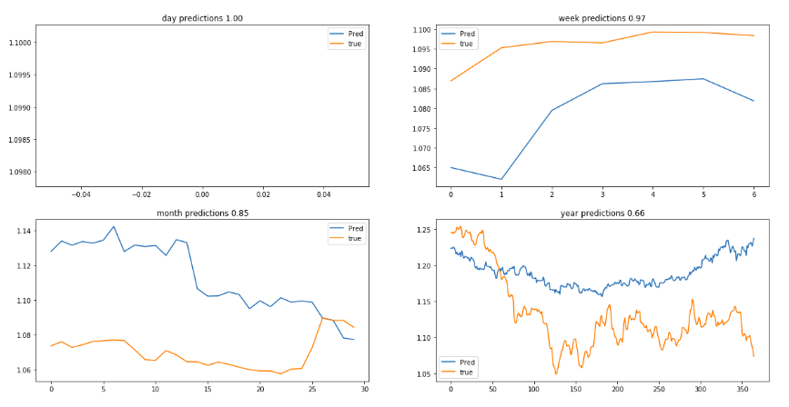
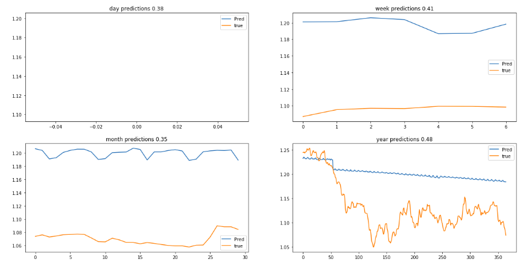
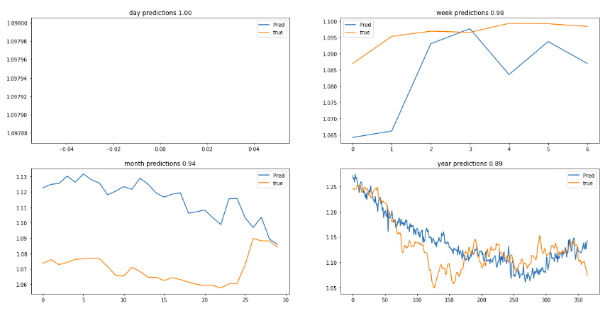

# Financial Model

a classification model that classify whether the EURUSD stock exchange will go up or down next day based on historical data


## Experiments

* ### Linear Regression
  i used linear regression model to evaluate the features in the future prediction of the time-series over the time

* ### Feature investigation
  i used multiple features and got the following results:

  * using the High-Low average as the only feature 
  * using `High`, `Low`, `Close`, `Volume`, `Avg`, `year`, `month`, `day` as features 
  * using `year`, `month`, `day`, `Volume` as features 
  * using 116 features that can be found [here](notebooks/FeatureEngineering.ipynb) 
* ### Classification
  i used multiple classifiers to get the best results, the main idea is the same, having the average of any day compared by the next day (the objective of the task), and the rate could be higher `1` or lower `0`, results could be found below

  * Adaboost classifier `1.61s` training time

  ```python
                precision    recall  f1-score   support

          0.0       0.55      0.60      0.57       230
          1.0       0.51      0.46      0.48       208

  avg / total       0.53      0.53      0.53       438
  ```

  * Random Forest `484ms` training time

  ```python
                precision    recall  f1-score   support

          0.0       0.61      0.61      0.61       230
          1.0       0.57      0.57      0.57       208

  avg / total       0.59      0.59      0.59       438

  ```

  * SGD Classifier `5.04s` training time

  ```python
                precision    recall  f1-score   support

          0.0       0.64      0.56      0.60       230
          1.0       0.57      0.65      0.61       208

  avg / total       0.61      0.60      0.60       438
  ```

  * SVC `473ms` training time

  ```python
                precision    recall  f1-score   support

          0.0       0.63      0.60      0.61       230
          1.0       0.58      0.61      0.59       208

  avg / total       0.60      0.60      0.60       438
  ```

## Conclusion

* ### Regression Investigations
  we could see clearly that the set of features could capture more of the time series and resulted in better model both on the short and long terms.
* ### Classification Investigations
  i chose the random forest with 100 estimator as it was the fastest to train and with the best accuracy with respect to the time it took to train.
